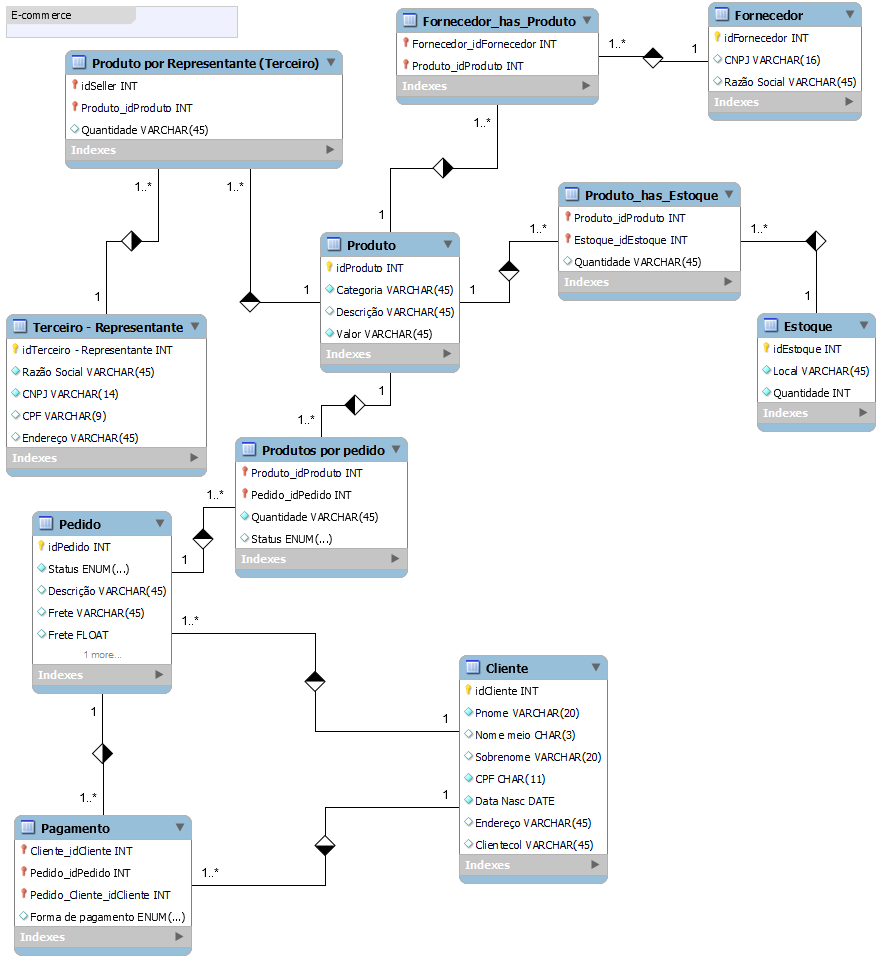

#  Modelagem do projeto de banco de dados para o cenário de e-commerce.


<h1 align="center">
   
</h1>


## Seed da base de dados pelo MySQL Workbench

```
/* INSERÇÃO DE DADOS E QUERIES */
use ecommerce;

show tables;

desc cliente;

insert into cliente (Fname, Minit, Lname, CPF, Address)
		values('Maria', 'M', 'Silva', '123456789', 'RUA TAL NUMERO TAL BAIRRO TAL - CIDADE TAL'),
			  ('João', 'S', 'Santos', '987654321', 'RUA QUALQUER NUMERO QUALQUER BAIRRO QUALQUER - CIDADE TAL'),
              ('Julia', 'A', 'Costa', '010203456', 'RUA ALI NUMERO ALI BAIRRO ALI - CIDADE TAL'),
              ('Isabela', 'N', 'Santos', '012365478', 'RUA FULANO NUMERO FULANO BAIRRO FUNALO - CIDADE TAL'),
              ('Allyson', 'S', 'Nascimento', '014789632', 'RUA FULANO NUMERO FULANO BAIRRO FUNALO - CIDADE TAL');
              
select * from cliente;
              
			
insert into product (Pname, Category, descrição, avaliação)
		values('Fone bluetooth', 'Eletrônico', null, '4'),
			  ('Jaqueta Jeans', 'Vestuário', null, '5'),
              ('Bola de futsal', 'Brinquedos', null, '3'),
              ('Cerveja Heineken', 'Alimentos', null, '5'),
              ('Cadeira Gamer', 'Móveis', null, '5'),
              ('Console Xbos S', 'Eletrônico', null, '5'),
              ('Console Xbos X', 'Eletrônico', null, '5');
              
select * from product;

insert into orders (idOrderClient, ordersStatus, ordersDescription, sendValue, paymentCash)
		values('1', 'Em processamento', 'Aguardando Pagamento', null, 1),
			  ('2', 'Confirmado', 'Pagamento confirmado', null, 0),
              ('3', 'Em processamento', 'Aguardando Pagamento', null, 1),
              ('4', 'Cancelado', 'Pagamento Recusado', null, 0);
              
select * from orders;

insert into productOrder( idPOProduct, idPOorder, poQuantity, poStatus)
		values(1,1,2, default),
			  (2,1,1, default),
              (3,2,1, default);
        
select * from productOrder;

insert into productStorage( storageLocation, quantity)
		values('POUSO ALEGRE', 1000),
              ('SANTA RITA DO SAPUCAÍ', 500),
              ('ITAJUBA', 700),
              ('PIRANGUINHO', 250),
              ('PIQUETE', 250),
              ('LORENA', 300);
              
select * from productStorage;

insert into StorageLocation (idLproduct, idLstorage, Location)
		values(1, 2, 'MG'),
			  (2, 6, 'SP');
              
select * from StorageLocation;

insert into supplier(SocialName, CNPJ)
		values( 'ELETRÔNICS LTDA', '16547521000016'),
			  ('ALIMENTICS LTDA', '17547896000017'),
              ('VESTUARICS LTDA', '1478524500015');
              
select * from supplier;
              
insert into productSupplier( idPsSupplier, idPsProduct, quantity)
		values(1,1,500),
			  (1,2,400),
              (2,1,300),
              (2,2,200),
              (3,1,100);
              
select * from productSupplier;

insert into seller( SocialName, CNPJ, CPF, location)
		values('HIGH TECH HOUSE', 1234567894524, null, 'POUSO ALEGRE'),
              ('SANTO GOLE', 36985478512347, null, 'SANTA RITA DO SAPUCAÍ'),
              ('VESTE BEM', null, 147258369, 'ITAJUBA');
              
select * from seller;

insert into productSeller(idPseller, idPproduct, productQuantity)
	 values(1, 2, 40),
           (2, 4, 80);

select count(*) from cliente;

select * from cliente c, orders o where c.idClient = idOrderClient;

select Fname, Lname, idOrders, ordersStatus from cliente c, orders o where c.idClient = idOrderClient;

select concat (Fname, ' ', Lname) as Client, idOrders as Request, ordersStatus as Status from cliente c, orders o where c.idClient = idOrderClient;

select * from cliente c inner join orders o ON c.idClient = o.idOrderClient
						inner join productOrder p on p.idPOorder = o.idOrders
				group by idClient;
                
select c.idClient, Fname, count(*) as Number_of_orders from cliente c
						inner join orders o ON c.idClient = o.idOrderClient
				group by idClient;

```

## Esquema relacional

```
/*Banco de dados para o cenário de E-commerce*/

/*drop database ecommerce;*/

create database ecommerce;

use ecommerce;

/* tabela cliente*/

create table cliente(
	idClient int auto_increment primary key,
    Fname varchar(20),
    Minit char(3),
    Lname varchar(20),
    CPF char(11) not null,
    Address varchar(255),
    constraint unique_cpf_client unique(CPF)
    
);

alter table cliente auto_increment=1;

desc cliente;

/* tabela produto*/

create table product(
	idProduct int auto_increment primary key,
    Pname varchar(20),
    Category enum ('Eletrônico', 'Vestuário', 'Brinquedos', 'Alimentos', 'Móveis')not null,
    descrição varchar(45),
    avaliação float default 0

);

/* tabela pagamento*/

create table payments(
	idClient int,
	idPayment int,
	type_payments enum ('PIX', 'CARTÃO CRÉDITO', 'CARTÃO DÉBITO'),
	primary key(idClient, idPayment)

);

/* tabela pedido*/

create table orders(
	idOrders int auto_increment primary key,
	idOrderClient int,
	ordersStatus enum ('Cancelado', 'Confirmado', 'Em processamento') default 'Em processamento',
	ordersDescription varchar (255),
	sendValue float default 0,
	paymentCash bool default false, 
	constraint fk_orders_client foreign key (idOrderClient) references cliente(idClient)
			on update cascade

);
desc orders;
/* tabela estoque */

create table productStorage(
	idProductStorage int auto_increment primary key,
    storageLocation varchar(255),
    quantity int default 0

);

/* tabela fornecedor */

create table supplier(
	idSupplier int auto_increment primary key,
    SocialName varchar(255) not null,
    CNPJ char(14) not null,
    constraint  unique_supplier unique (CNPJ)
    
);

desc supplier;

/* tabela vendedor */

create table seller (
	idSeller int auto_increment primary key,
    SocialName varchar(255) not null,
    CNPJ char(14),
    CPF char(9),
    location varchar(255),
    constraint unique_cnpj_seller unique (CNPJ),
    constraint unique_cpf_seller unique (CNPJ)
);

create table productSeller(
	idPseller int,
    idPproduct int,
    productQuantity int default 1,
    primary key (idPseller, idPproduct),
    constraint fK_product_seller foreign key (idPseller) references seller(idSeller),
    constraint fk_product_product foreign key (idPproduct) references product(idProduct)

);

desc productSeller;

create table productOrder(
	idPOProduct int,
    idPOorder int,
    poQuantity int default 1,
    poStatus enum ('Disponível', 'Sem estoque') default 'Disponível',
    primary key (idPOproduct, idPOorder),
    constraint fK_product_order_seller foreign key (idPOproduct) references product(idProduct),
    constraint fk_product_order_product foreign key (idPOorder) references orders(idOrders)

);

create table StorageLocation(
	idLproduct int,
    idLstorage int,
    Location varchar(255),
    primary key (idLproduct, idLstorage),
    constraint fK_storage_location_product foreign key (idLproduct) references product(idProduct),
    constraint fk_storage_location_storage foreign key (idLstorage) references productStorage(idProductStorage)

);

create table productSupplier(
idPsSupplier int,
idPsProduct int,
quantity int not null,
constraint fk_product_supplier_supplier foreign key (idPsSupplier) references supplier(idSupplier),
constraint fk_product_supplier_product foreign key (idPsProduct) references product(idProduct)

);

show tables;

show databases;

use information_schema;

select * from referential_constraints where constraint_schema = 'ecommerce';


```